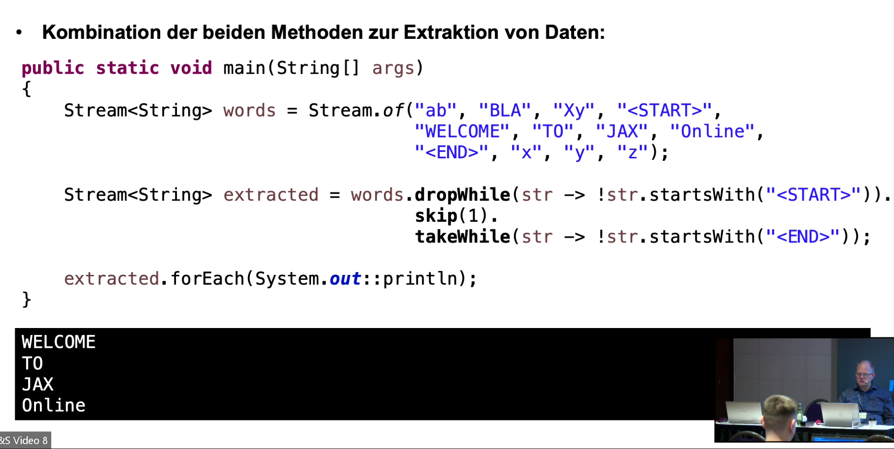
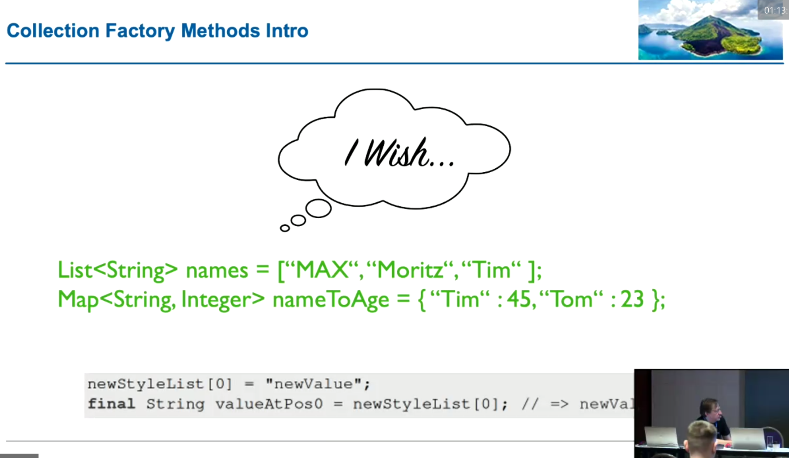

# PART 1: Syntax-Erweiterungen & Neuheiten und Änderungen bis Java 11

## allgemein
- @Deprecated(since = "7.2", forRemoval = true)

## var

### Spezialfälle
- var mixedContenxt = new ArrayList<>(); // -> new ArrayList<Object>();
- var names = new ArrayList<String>(); // -> ArrayList<String> und nicht List<String>

### klappt nicht
- var numbers = {1, 2, 3}
- Lambdas: Compiler hat nicht genügend Typ-Information für die Inferenz

## Stream
- takeWhile() -> Predicate, solange wie die Bedingung erfüllt ist; Abbruch, sobald erstes Mal nicht erfüllt
- dropWhile() -> überspringt alle Element, bis die gegebene Bedingung erfüllt ist (ab dann keine Prüfung mehr!)

- filtering() -> Histogramm-Aufbereitung (auch "nicht Treffer" bleiben aufgelistet)
  - bei filter() würden "nicht Treffer" komplett ausgefiltert
- flatMappging() -> Mappen und zusammenfügen von Elementen

## Optional<T>
- praktische Möglichkeiten "else" zu definieren, wenn etwas nicht vorhanden ist
  - ifPresentOrElse()
  - or() -> gut für Verarbeitungsketten (nur bis zum 1. Treffer wird tatsächlich ausgeführt)
  - stream()
  - get() + orElseThrow() -> semantisch identisch, nicht gutes API-Design
  - isEmpty() -> isAbsent() wäre das Gegenteil von isPresent(); bei Collections ist "empty" jedoch gängig
    - es ist schwierig, ein API konsistent "über alles" zu designen

## Collection Factory Methods
- 
- List.of(), Set.of(), Map.of(), Map.ofEntries(entry(5, "five"), entry(6, "six"))
  - Map.ofEntries() -> bessere Unterscheidung von "key" und "value"
- Set.of() -> IllegalArgumentException bei Duplikaten

## Strings
- isBlank() -> nicht null save "blank" check
- lines() -> multiline Strings zeilenweise
- repeat() -> n-Mal wiederholen
- strip() / stripLeading() / stripTrailing()
  - im Unicode gibt es "halbe" Leerzeichen; trim() kennt das noch nicht; strip() schon

# Excercises
- 4
- 6
- 7a / 7b