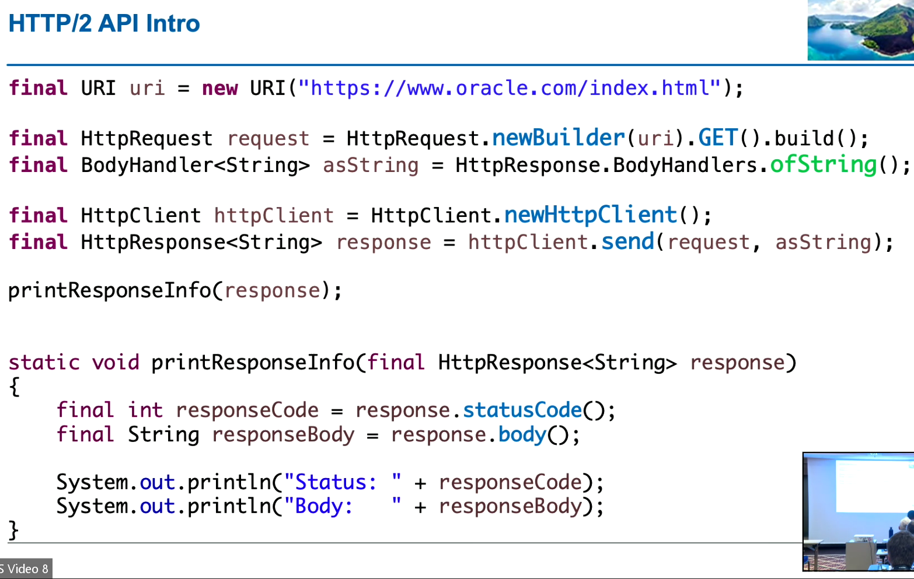
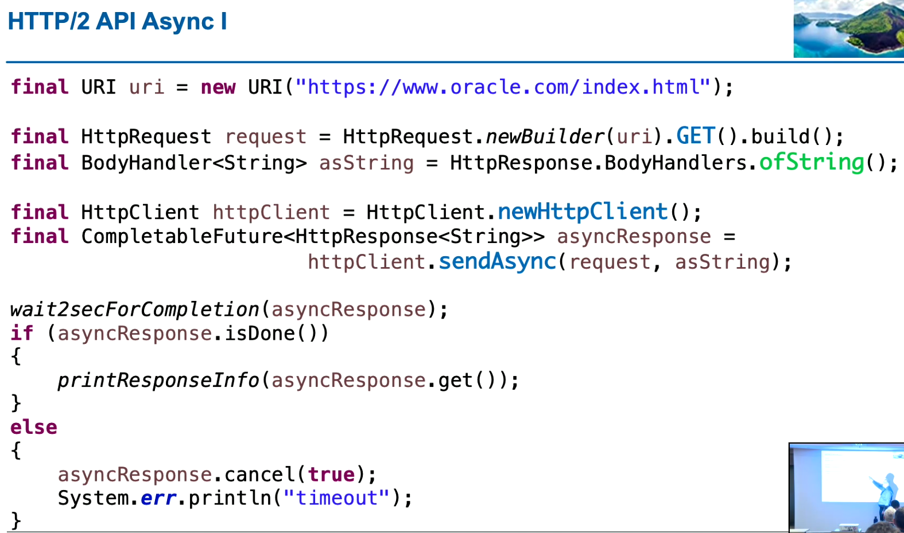

# PART 2: Weitere Neuheiten und Änderungen bis JDK 11

## Date API
- .dateUntil()
  - wieviele Sonntage gibt es im Jahr 2017?
  - wieviele Schaltjahre gibt es zwischen 2000 und 2020?
- LocalDate.now().with(TemporalAdjusters.firstDayOfNextMonth())

## InputStream und Reader
- InputStream
  - transferTo(OutputStream out)
  - readAllBytes()
  - readNBytes()
- Reader
  - transferTo(Writer writer)
- Files.writeString() -> Achtung: Default überschreibt den Inhalt der Datei; APPEND muss speziell aktiviert werden

## Multi-Threading mit CompletableFuture
- CompletableFuture<T>
  - supplyAsync() -> Berechnung definieren
  - thenApply() -> Ergebnis der Berechnung verarbeiten
  - thenAccept() -> Ergebnis verarbeiten, aber ohne Rückgabe
  - thenCombine() -> Verarbeitungsschritte zusammenführen
- Vorgehen
  - 1. sequentiell
  - 2. parallelisieren, wo es sich lohnt
- ExceptionHandling
  - .exceptionally(throwable -> ...)
  - .orTimeout() -> Abbruch nach bestimmter Zeit (Exception)
  - .completeOnTimeout() -> Alternativen Code ausführen nach bestimmter Zeit

## http/2
- 
- 

## Direct Compilation
- z.B. für Ausführung von kleineren Java-Dateien als Script
- Shebang Execution
  - #!/usr/bin/java --source 11
  - Datei darf nicht mit .java enden
  - muss executable sein (chmod +x)

## JShell
- repl loop
- zum Ausprobieren von neuen Features in ganz neuen JDKs
- Für allererste Schritte ohne Ballast
- ab Java 14 mit brauchbarem Multiline Editor

## Deprecations
- Doppelungen mit Java EE Spezifikationen entfernt
  - java.xml.bind
  - java.xml.ws
  - java.xml.ws.annotation
  - java.se.ee -> Aggregator-Modul für diese Module
  - Modul-System hilft enorm, um entscheiden zu können, wo etwas verwendet wird, und ob es entfernt werden kann
- Observer, Observable (ohne Generics, Observable ist kein Interface)
- Thread.destroy(), Thread.stop()
- Object.finalize()
- new Integer() / new Long() -> valueOf(), parseXxx()
- Applets
- Tool: jdeprscan -> Finden von deprecated Methoden / Klassen

## Übungen
- Aufgabe 1 oder 2
- 6
- 7 HTTP/2
- 8 (falls Zeit)
