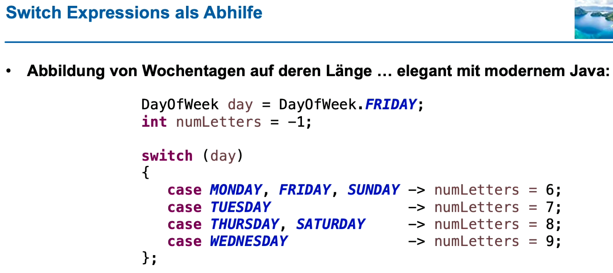
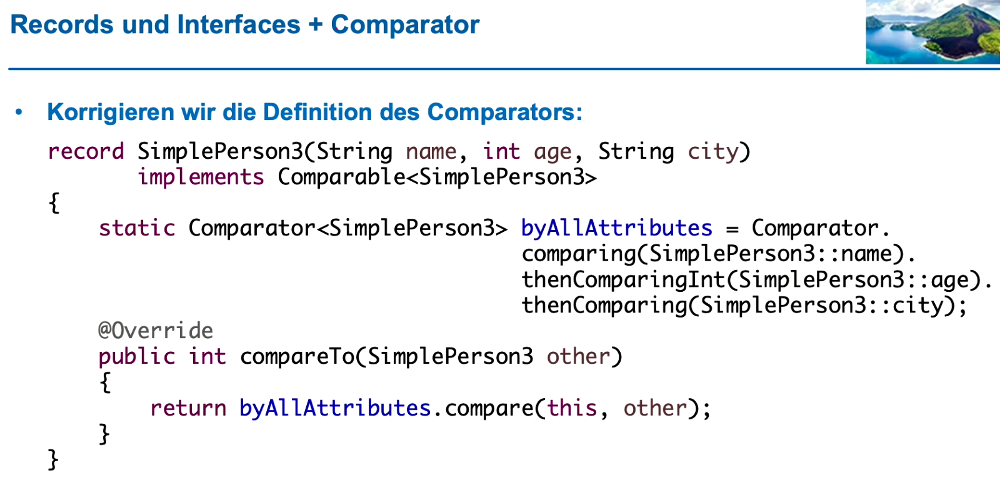
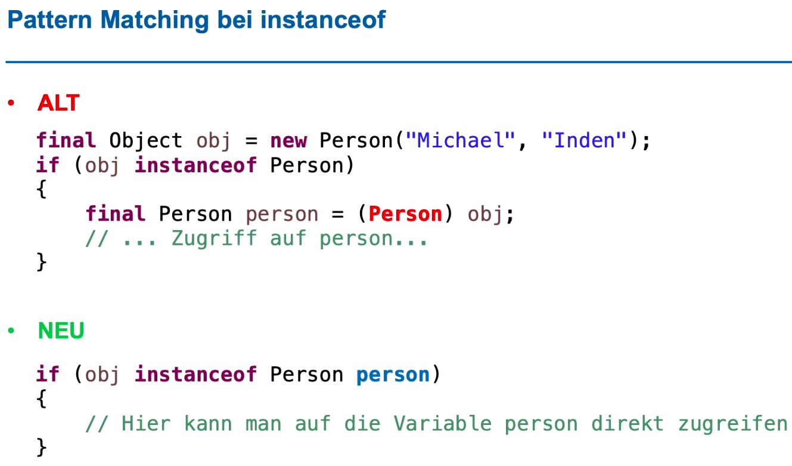

# PART 3: Syntax-Erweiterungen & Neuheiten und Änderungen in Java 12 bis 17

## switch
- lästig
  - break vergessen -> fall through
  - begrenzte Typen als Wert für case
- Switch Expressions
  - 
  - Ausdrücke können als Wert verwendet werden (ab Java 13)
  - Compiler meldet, wenn Abdeckung bei Enums nicht vollständig
  - "fall through" gibts nicht mehr (break nicht notwendig)
  - switch gibt Rückgabewert -> keine extra Zwischenvariablen notwendig
  - neues keyword "yield" (alternativ zu "->")
    - yield ist notwendig, wenn hinter "->" ein Code-Block folgt (da "return" im Block nicht klappt)

## text blocks
- multiline Strings waren lange mühsam
- """ <multiline text> """
- """.formatted() -> Platzhalter im Text; Werte für Platzhalter als Parameter von formatted()
- Leerraum am Anfang der Zeile innerhalb des Multiline-Strings wird automatisch entfernt
- Langer text im Editor formatiert; mit "\" kann angegeben werden, dass  kein Linebreak im resultierenden Text stehen bleibt

## records
- einfache, unveränderliche Datencontainer
  - Implementierungen von Accessor-Methoden sowie equals() und hashCode() automatisch und vor allem kontraktkonform
  - Nebenbemerkung: hashcode -> nur von unveränderlichen Attributen, sonst wird das Objekt plötzlich im Hashtable nicht mehr gefunden
- für komplexere Rückgabewerte und Parameter
- Ersatz für Pair (auch für primitive Typen möglich)
- Konstruktor
  - muss die Parameter nicht ausgeschrieben haben (sind bereits im Record definiert)
  - Setzen der Attribute muss nicht ausgeschrieben werden (werden immer automatisch gesetzt)

### beyond the basics
- Verwendung in TreeSet (sorted!)
  - 
- Builder-Pattern
  - verschiedene Konstruktoren, welche mit Default-Werten funktionieren
  - Möglichkeiten
    - Objekte im Record müssen ebenfalls records sein
    - Ausprogrammieren...
- Immutability bei Records klappt nur, wenn die Objekte, welche im Record gespeichert werden, auch immutable sind

## instanceof
- 

## Local Enums und Interfaces
- seit Java 15 können lokale Enums und Interfaces definiert werden (vorher nur anonyme Inner Classes)
  -> Konsistenz-Verbesserung
- vermutlich eher nicht häufig benötigt

## Sealed Types
- früher: final für Klasse / Methoden -> nicht ableitbar
- Steuert die Vererbung von Klassen (vermutlich v.a. in einem Framework hilfreich)
  - Vollständigkeitsprüfung in einem switch dadurch möglich
- in Business-Code eher wenige Anwendungsfälle
- -> mit Bedacht verwenden; schränkt im Prinzip vorgesehene Flexibilität im Code ein

# Aufgaben
- 2
- 4
- 6
- 7