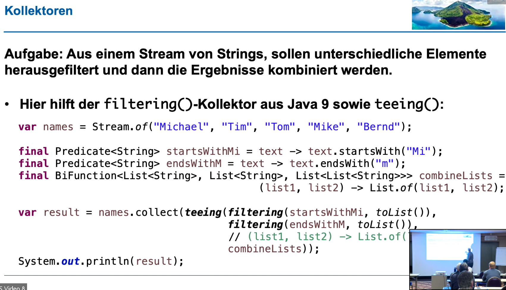

# PART 4: Neuheiten und Änderungen in den APIs in Java 12 bis 17

## String APIs
- indent() -> einrücken + Linebreak (!)
  - v.a. sinnvolle, wenn ein multiline String eingerückt werden soll
- transform() -> Umformungen mit Lambdas

## CompactNumberFormat
- Abbildung von kompakteren Zahlendarstellungen (z.B. "1K" -> 1 KByte)
- Können auch als Parser verwendet werden (Achtung "1K" und "1 K" sind dann nicht dasselbe)

## Files
- writeString()
- mismatch() -> wenn der Inhalt nicht gleich ist, kommt die Position des Mismatch zurück (sonst -1)
  - Achtung: Encoding muss gleich sein!

## Teeing()-Kollektor
- 2 Aktionen am Ende der Stream-Verarbeitung
  - z.B. zählen und zusammenfügen
  - 

## Stream.toList() / mapMulti()
- toList() -> convenience für collector(Colletions.toList())
- mapMulti() -> flatMap() Nachfolger (?)

## Deprecations
- new Long() (deprecated + marked for removal)