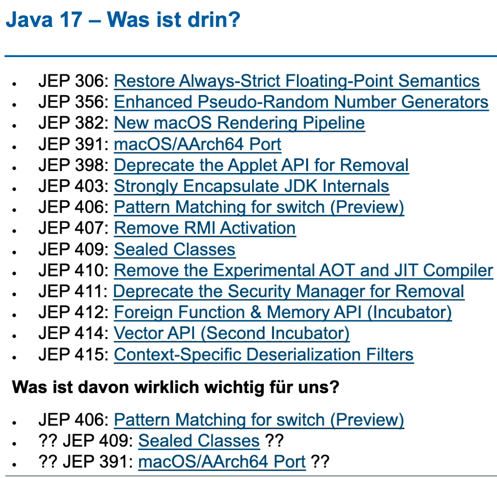

# PART 5: Neuheiten und Änderungen in der JVM in Java 12 bis 17

## Hilfreiche NullPointerExceptions
- wesentlich verständlichere Messages

## JMH (Microbenchmarks)
- erst als letzte Option nach
  - Design-Probleme
  - higher Level Abstractions
  - Einsatz von Profiler
- Problem von currentTimeMillis()
  - Virenscanner / Garbage Collector läuft
- Besser: Mehrere Iterationen -> Aufwärmen, damit die Optimierungen der JVM durch sind
=> Nicht selbst machen - JMH einsetzen! Sonst misst man vermutlich meist nicht das, was man wollte

## JPackage
- plattformabhängigen Installer "generieren"

## JavaScript-Engine
- seit Java 15 entfernt
  - Aufwand zur Pflege war relativ hoch
- Alternative: JShell programmatisch verwenden (JShell API)

## Rekapitulieren der Neuerungen
- 
- https://javaalmanac.io - Vergleich der APIs aller JDK Versionen
- pattern matching bei switch
  - null kann als input verwendet werden
  - "case null" kann verwendet behandelt werden
  - ähnlich wie bei instanceof: "case String str && str.startsWith("V1") -> ..."