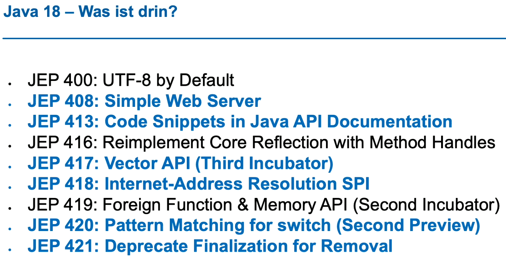

# Neuheiten in Java 18

## Build Tools und IDEs
- nicht viel zu tun (nicht viele Syntax-Änderungen)

## Vector API
- Incubator Zustand -> kann wieder rausfliegen

## JEPs in Java 18
- 

### Simple Web Server
- für Bereitstellung von statischen Dateien
- ganz simples Ding eher für Testing

### Code Snippets in Java Doc
- {@snippet:
    if (optValue.isPresent()) // @highlight substring="isPresent"
  }

### Vector API
- nichts zu tun mit dem alten Java Vector api
- Berechnungen mit Vektoren -> Bessere Ausnützung moderner Prozessor-Features (Single Instruction Multiple Data SIMD)
- Compiler optimiert automatisch (wenn er kann...)
  - in komplexeren Fällen (z.B. kompliziertere Matrix-Multiplikationen) kann Faktor 20 in Geschwindigkeitsverbesserungen herauskommen

### Internet-Address Resolution SPI
- Auflösung von Internet-Adressen war bisher hartcodiert -> kaum Testbarer Code
- neu: via InetAdressResolver können Custom-Implementierungen hinterlegt werden

### Pattern Matching bei switch (preview II)
- Änderungen
  - Dominanzprüfung ändert sich
  - Vollständigkeitsanalyse korrigiert
- Dominanzprüfung: generischere Matches vor Spezialisierten werden erkannt
  - vorher: spezialisiertere wurde abhängig von der Reihenfolge evtl. gar nie verwendet

### deprecations
- deprecate finalization for removal
  - Hintergründe siehe Link auf youtube
  - funktionierte nicht so, wie man es sich früher gedacht hatte
  => finalize nicht verwenden!
- diverse überladene Runtime.exec() Methoden
- Runtime.runFinalization()
- Thread.stop() -> forRemoval=true